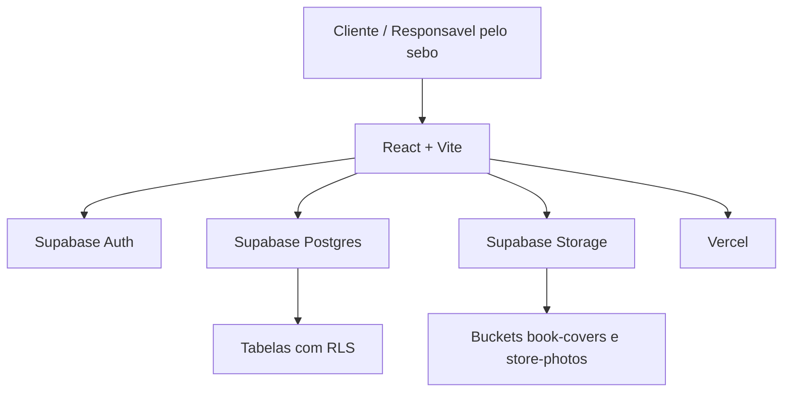

# Guia de estudo para apresentacao - Sebo Virtual

Este documento foi feito para o grupo estudar o projeto e se preparar para perguntas do professor. A ideia e que todo mundo consiga explicar o objetivo, as telas, a arquitetura, o banco de dados e as decisoes tecnicas sem depender de uma unica pessoa.

## Resumo rapido

O Sebo Virtual e um sistema web para reunir catalogos de sebos independentes em um so lugar. O leitor pesquisa livros usados, ve detalhes do exemplar e fala com o sebo pelo WhatsApp. O responsavel pelo sebo consegue criar conta, cadastrar o estabelecimento e gerenciar os livros do acervo.

O projeto e um MVP de TCC. MVP significa Minimum Viable Product, ou seja, uma primeira versao funcional com as principais partes do sistema.

Links principais:

- Site em producao: https://sebo-virtual.vercel.app/
- Repositorio: https://github.com/glp711/sebotek
- Backend/Banco: Supabase
- Frontend: React + TypeScript + Vite

## Problema que o projeto resolve

Muitos sebos pequenos nao possuem uma vitrine digital organizada. O cliente precisa perguntar manualmente, mandar mensagem em varios lugares ou ir presencialmente sem saber se o livro existe. O Sebo Virtual centraliza essa busca.

O sistema ajuda:

- Leitores a encontrar livros usados com mais facilidade.
- Sebos a divulgar o acervo sem precisar criar uma loja completa do zero.
- O projeto a demonstrar integracao real entre frontend, autenticacao, banco de dados, regras de seguranca e deploy.

## Publico-alvo

O sistema tem dois tipos principais de usuario:

1. Cliente/leitor:
   Procura livros, abre detalhes, salva desejos na wishlist e entra em contato com o sebo.

2. Responsavel pelo sebo:
   Cria conta, cadastra o sebo, publica livros, edita dados do acervo e controla estoque.

## Funcionalidades prontas

Funcionalidades do catalogo publico:

- Busca por titulo, autor, categoria, ISBN e nome do sebo.
- Filtros por categoria e estado de conservacao.
- Ordenacao por recentes, menor preco, maior preco e titulo.
- Cards de livros clicaveis.
- Modal de detalhes do livro.
- Exibicao de capa, resumo, preco, quantidade, ISBN, editora, ano e estado.
- Botao para chamar o sebo no WhatsApp.

Funcionalidades da area de sebos:

- Cadastro e login do responsavel.
- Recuperacao de senha.
- Cadastro do sebo para aprovacao.
- Bloqueio de cadastro de livros enquanto o sebo esta em analise.
- Cadastro de livros apos aprovacao administrativa.
- Edicao de livros ja cadastrados.
- Remocao de livros.
- Busca dentro do proprio acervo.
- Controle de estoque, inclusive quantidade zero.
- Estatisticas do acervo: titulos, exemplares, livros sem estoque e livros com capa.

Funcionalidades da area do cliente:

- Cadastro e login de cliente.
- Recuperacao de senha.
- Perfil do cliente.
- Wishlist para salvar livros desejados.
- Remocao de itens da wishlist.
- Busca no catalogo a partir da wishlist.

Funcionalidades de autenticacao:

- Confirmacao de email.
- Redefinicao de senha.
- Paginas especificas para retorno do Supabase Auth:
  - `/auth/confirm`
  - `/auth/reset-password`

Funcionalidades administrativas:

- Painel `Admin` visivel para contas com role `ADMIN`.
- Listagem de sebos pendentes, aprovados e todos.
- Botao para aprovar cadastro de sebo.
- Botao para voltar um sebo aprovado para analise.
- Regras no banco impedindo que lojistas criem livros antes da aprovacao.

## Arquitetura do sistema

A arquitetura atual ficou assim:



Explicacao:

- React cuida da interface.
- Vite cuida do ambiente de desenvolvimento e build.
- TypeScript ajuda a evitar erros de tipo no codigo.
- Supabase Auth faz login, cadastro, confirmacao de email e recuperacao de senha.
- Supabase Postgres guarda sebos, livros, perfis, avaliacoes e wishlist.
- RLS protege as tabelas para cada usuario acessar apenas o que deve.
- Supabase Storage foi previsto para guardar imagens de capas e fotos dos sebos.
- Vercel hospeda o frontend em producao.

## Por que usamos Supabase

O Supabase foi escolhido porque entrega varios recursos prontos em um unico lugar:

- Banco PostgreSQL.
- Autenticacao.
- API REST automatica.
- Regras de seguranca com Row Level Security.
- Storage para arquivos.
- Dashboard para administrar dados.

Isso ajudou o TCC porque o grupo consegue focar no produto e nas regras do sistema, sem precisar construir do zero login, banco, API e upload.

## Por que nao usamos Node.js + Express agora

No escopo atual, o frontend conversa direto com o Supabase usando a chave publica do projeto. Isso e aceitavel porque as regras importantes ficam no banco usando RLS.

Node.js + Express pode entrar em uma fase futura para:

- Notificacoes automaticas.
- Regras administrativas mais complexas.
- Relatorios.
- Jobs em segundo plano.
- Integracoes externas.

Para o MVP, Supabase ja cobre o necessario.

## Banco de dados

Principais tabelas:

- `profiles`: dados do usuario, nome e papel no sistema.
- `stores`: dados dos sebos.
- `books`: livros cadastrados pelos sebos.
- `reviews`: avaliacoes dos sebos.
- `wishlists`: desejos salvos pelos clientes.
- `wishlist_matches`: base para relacionar desejos com livros encontrados.

Principais campos de `books`:

- `title`: titulo.
- `author`: autor.
- `isbn`: codigo ISBN.
- `category`: categoria.
- `summary`: resumo ou observacoes.
- `publisher`: editora.
- `published_year`: ano de publicacao.
- `condition`: estado de conservacao.
- `price`: preco.
- `quantity`: estoque.
- `cover_url`: link da capa.
- `store_id`: sebo dono do livro.

## Seguranca e RLS

RLS significa Row Level Security. Em portugues, seguranca em nivel de linha.

Isso quer dizer que o banco decide quais linhas cada usuario pode ver, criar, editar ou apagar.

Exemplos no projeto:

- O publico pode ler livros de sebos aprovados e com estoque.
- O dono do sebo pode ler todos os proprios livros, inclusive sem estoque.
- O dono do sebo so pode criar livros dentro do proprio sebo depois que ele for aprovado.
- O dono do sebo so pode editar ou apagar livros do proprio sebo.
- O admin pode analisar e alterar o status de aprovacao dos sebos.
- O cliente so pode ver e alterar a propria wishlist.

Ponto importante para responder:

Nao usamos chave secreta no frontend. O navegador usa apenas a chave publica/publishable. A seguranca real fica nas policies do Supabase.

## Fluxo do cliente

1. Abre o site.
2. Pesquisa um livro.
3. Usa filtros se quiser.
4. Clica no livro.
5. Ve detalhes do exemplar.
6. Chama o sebo pelo WhatsApp.
7. Se estiver logado como cliente, pode salvar desejos na wishlist.

## Fluxo do responsavel pelo sebo

1. Entra em `Area do sebo`.
2. Cria uma conta ou faz login.
3. Cadastra o sebo com nome, endereco, telefone e horario.
4. Aguarda aprovacao administrativa.
5. Depois da aprovacao, cadastra livros no acervo.
6. Edita livros quando mudar preco, estoque ou informacoes.
7. Remove livros que nao devem mais aparecer.
8. Controla estoque pelo painel `Meu acervo`.

## Fluxo do administrador

1. Entra no sistema com uma conta `ADMIN`.
2. Abre a aba `Admin`.
3. Ve os sebos pendentes de verificacao.
4. Confere nome, descricao, endereco, telefone e horario.
5. Aprova o sebo quando estiver correto.
6. Se houver problema, mantem pendente ou volta um sebo aprovado para analise.
7. Depois da aprovacao, o lojista consegue cadastrar livros.

## Fluxo de autenticacao

O Supabase envia emails automaticos para:

- Confirmar cadastro.
- Recuperar senha.

As URLs configuradas para retorno sao:

- `https://sebo-virtual.vercel.app/auth/confirm`
- `https://sebo-virtual.vercel.app/auth/reset-password`

No desenvolvimento local, tambem podem ser usadas:

- `http://localhost:5174/auth/confirm`
- `http://localhost:5174/auth/reset-password`
- `http://127.0.0.1:5174/auth/confirm`
- `http://127.0.0.1:5174/auth/reset-password`

## Estrutura do projeto

Arquivos e pastas importantes:

- `src/App.tsx`: principal tela e componentes da aplicacao.
- `src/App.css`: estilos do site.
- `src/lib/catalog.ts`: funcoes que conversam com Supabase.
- `src/lib/supabase.ts`: configuracao do cliente Supabase.
- `src/types.ts`: tipos TypeScript usados no projeto.
- `src/data/demoCatalog.ts`: dados de demonstracao quando Supabase nao esta configurado.
- `supabase/migrations/`: scripts SQL do banco.
- `docs/guia-de-uso.md`: guia para usar o sistema.
- `docs/guia-estudo-apresentacao.md`: este documento de estudo.
- `vercel.json`: configuracao de build e rotas da Vercel.

## Como rodar localmente

Comandos:

```bash
npm install
cp .env.example .env.local
npm run dev
```

No Windows PowerShell:

```powershell
Copy-Item .env.example .env.local
npm run dev
```

Variaveis necessarias no `.env.local`:

```env
VITE_SUPABASE_URL=https://seu-projeto.supabase.co
VITE_SUPABASE_PUBLISHABLE_KEY=sua_chave_publica
```

Nunca colocar no frontend:

- `service_role`
- `sb_secret`
- senha de banco
- token administrativo

## Como demonstrar para o professor

Roteiro sugerido:

1. Abrir o site em producao.
2. Mostrar o nome Sebo Virtual e explicar o problema.
3. Pesquisar por um livro, por exemplo `Marina`.
4. Abrir o card do livro.
5. Mostrar capa, preco, estoque, detalhes e WhatsApp.
6. Mostrar filtros e ordenacao.
7. Entrar na aba `Sebos`.
8. Mostrar dados dos sebos parceiros.
9. Entrar em `Cliente` e explicar login, perfil e wishlist.
10. Entrar em `Area do sebo`.
11. Explicar cadastro do sebo e painel de acervo.
12. Entrar no painel `Admin` e explicar a aprovacao dos sebos.
13. Explicar que o banco usa Supabase, Auth, Postgres e RLS.
14. Mostrar rapidamente o GitHub ou as migrations se o professor pedir parte tecnica.

## Perguntas provaveis do professor

### Qual e o objetivo do projeto?

Criar uma plataforma para centralizar acervos de sebos independentes, facilitando a busca de livros usados e o contato entre leitor e sebo.

### O sistema ja esta funcionando?

Sim. Ele possui catalogo publico, detalhes de livros, area de cliente, login, wishlist, area do sebo, cadastro de livros, edicao, remocao e deploy em producao na Vercel.

### Qual tecnologia foi usada no frontend?

React com TypeScript e Vite.

### Qual tecnologia foi usada no backend?

Supabase, usando Auth, Postgres, API REST, RLS e Storage.

### Por que escolher Supabase?

Porque ele fornece autenticacao, banco PostgreSQL, API e seguranca por RLS em uma unica plataforma. Isso acelera o desenvolvimento do MVP.

### O que e RLS?

RLS e Row Level Security. E um recurso do PostgreSQL que permite criar regras para controlar quais linhas cada usuario pode acessar ou modificar.

### Como voces evitam que um sebo edite livro de outro sebo?

As policies do Supabase verificam se o usuario logado e dono do `store_id` associado ao livro. Se nao for dono, o banco bloqueia update e delete.

### Como o cliente entra em contato com o sebo?

Pelo botao de WhatsApp no detalhe do livro. O sistema monta uma mensagem automatica com o titulo e autor do livro.

### O que acontece se o Supabase nao estiver configurado?

O app abre com dados demonstrativos locais, permitindo apresentar a interface mesmo sem conexao com o banco.

### O sistema tem upload de imagem?

O banco e o Storage ja possuem estrutura prevista para capas de livros e fotos de sebos. No MVP atual, o cadastro aceita link de capa. Upload direto para bucket pode ser uma melhoria futura.

### Como funciona a aprovacao do sebo?

O sebo e cadastrado como pendente. Uma conta com role `ADMIN` acessa o painel administrativo, revisa os dados e aprova o cadastro. Antes da aprovacao, o lojista nao consegue cadastrar livros. Essa regra existe na interface e tambem nas policies do Supabase.

### O lojista consegue se aprovar sozinho?

Nao. A permissao de aprovar fica restrita a contas com role `ADMIN`. O dono do sebo consegue cadastrar o proprio sebo, mas nao consegue alterar o status `approved` para liberar produtos.

### Por que livros sem estoque nao aparecem publicamente?

Para nao frustrar o cliente. O publico ve apenas livros disponiveis. Mas o dono do sebo ve os livros sem estoque no painel para poder repor ou editar.

### Qual foi a maior preocupacao de seguranca?

Nao expor chave secreta no frontend e usar RLS para proteger dados por usuario. O navegador usa somente a chave publica.

### Como o projeto foi publicado?

Foi publicado na Vercel, com build automatico do Vite e rotas configuradas para funcionar com paginas como `/auth/confirm` e `/auth/reset-password`.

## Divisao sugerida para o grupo estudar

Pessoa 1: problema, objetivo, publico-alvo e demonstracao do catalogo.

Pessoa 2: area do cliente, login, wishlist e fluxo de recuperacao de senha.

Pessoa 3: area do sebo, cadastro do estabelecimento, aprovacao e CRUD de livros.

Pessoa 4: painel administrativo, arquitetura, Supabase, banco, RLS, Vercel e GitHub.

Se o grupo for menor, uma pessoa pode ficar com produto e telas, outra com parte tecnica.

## Pontos fortes para destacar

- Projeto tem aplicacao real para sebos.
- Site esta online.
- Banco real integrado.
- Login e recuperacao de senha funcionam via Supabase Auth.
- Existem regras de seguranca no banco.
- Interface tem catalogo, filtros, modal e painel do lojista.
- Existe fluxo de verificacao administrativa antes da criacao de produtos.
- O projeto tem documentacao e migrations.
- A arquitetura pode crescer para incluir Node/Express se necessario.

## Limitacoes atuais

- Upload direto de capas ainda nao foi implementado na interface.
- Reservas ainda nao foram implementadas.
- Notificacao automatica de wishlist ainda e uma melhoria futura.
- Avaliacoes e mapa podem ser aprofundados em proximas versoes.

## Melhorias futuras

- Historico de analise com motivo de aprovacao/reprova.
- Upload de capas usando Supabase Storage.
- Reserva de livros.
- Notificacao quando um livro da wishlist aparecer.
- Avaliacao de sebos.
- Mapa com sebos proximos.
- Relatorios para o sebo.
- Backend Node.js para tarefas agendadas e regras administrativas avancadas.

## Frase curta para apresentar

O Sebo Virtual e uma plataforma web que conecta leitores a sebos independentes, permitindo pesquisar livros usados, visualizar detalhes do exemplar e entrar em contato pelo WhatsApp, enquanto o sebo consegue gerenciar seu acervo em um painel proprio com seguranca usando Supabase.
